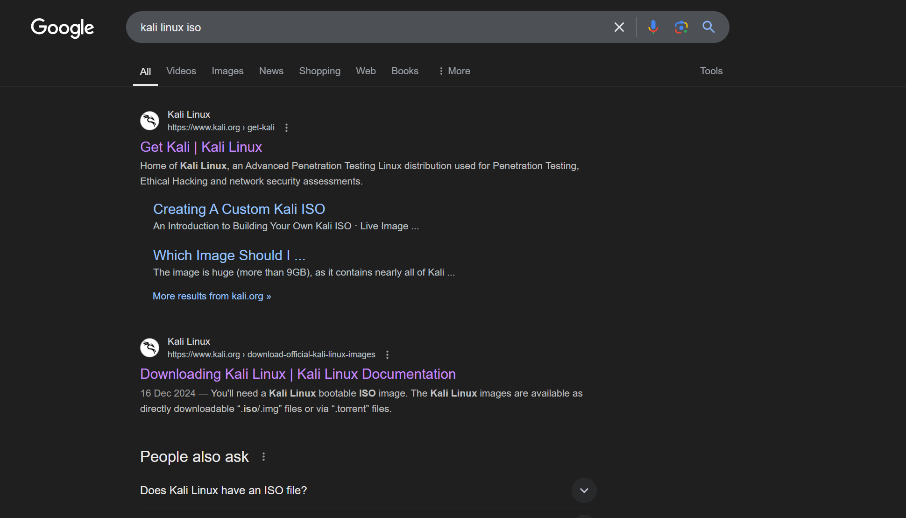

# VisitMarker for Google Search Results

**VisitMarker** is a Chrome extension that enhances your Google search experience by displaying the last time you visited a webpage directly on the search results page.

---

## Features

- Displays "Last visited" information next to **main search result titles** on Google.
- Works dynamically with Google search results, including additional results loaded via scrolling or pagination.
- Avoids duplication of data or redundant processing for optimized performance.
- Respects user privacy by using local browser history only.


## Privacy

This extension only uses your local browser history to display "last visited" information. No data is sent to external servers or stored outside your browser as it uses only local chrome.storage API to store data.


## Permissions

The extension requires the following permissions:

- **`history`**: To fetch your browsing history and retrieve the last visit timestamps.
- **Host permission** for `https://*.google.com/*`: Ensures the extension works ONLY on Google search pages.


## How It Works

1. **Targeting Main Results**: The extension identifies main search result titles (usually in blue text) by targeting specific DOM elements.
2. **Fetching History**: It uses the Chrome `history` API to find the most recent visit to a domain.
3. **Displaying Data**: Appends the "Last visited" timestamp to the search result titles.
4. **Dynamic Updates**: Handles dynamically loaded content using a `MutationObserver`.


## Installation

1. Clone or download this repository to your local machine.
2. Open Chrome and go to `chrome://extensions/`.
3. Enable **Developer mode** in the top right corner.
4. Click **Load unpacked** and select the folder containing this extension's files.
5. Perform a Google search to see the extension in action!


## File Structure

```
VisitMarker/
│
├── manifest.json   # Chrome extension configuration
├── background.js   # Handles browser history requests
├── content.js      # Injected script to modify Google search results
├── before.png      # Screenshot of google results page before visit
├── after.png       # Screenshot of google results page after visit
└── README.md       # Project readme
```


### Screenshot
#### Before visting a page: 


#### After visting a page: 


## Development

1. Make changes to the files as needed.
2. Reload the extension in Chrome:
   - Open `chrome://extensions/`.
   - Click the refresh icon next to the "VisitMarker" extension.
3. Test your changes on a Google search results page.


## Contributing

Contributions are welcome! Follow these steps to contribute:

1. Fork the repository.
2. Create a new branch for your feature/bug fix:
   ```bash
   git checkout -b feature-or-fix-name
   ```
3. Commit your changes and push the branch:
   ```bash
   git commit -m "Description of your changes"
   git push origin feature-or-fix-name
   ```
4. Open a Pull Request and describe your changes.


## License

This project is licensed under the [MIT License](LICENSE).

Feel free to use, modify, and distribute this extension as per the terms of the license.


## Feedback and Support

If you encounter any issues or have feature requests, feel free to open an issue on the [GitHub repository](https://github.com/dhamodaran-pandiyan/VisitMarker).

---

Thank you for using **VisitMarker**! 🚀
